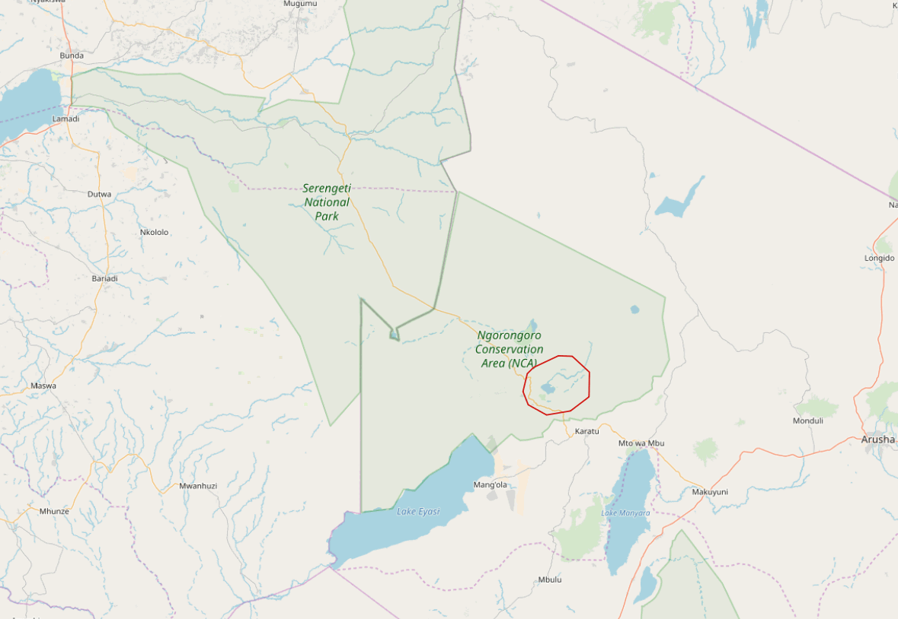
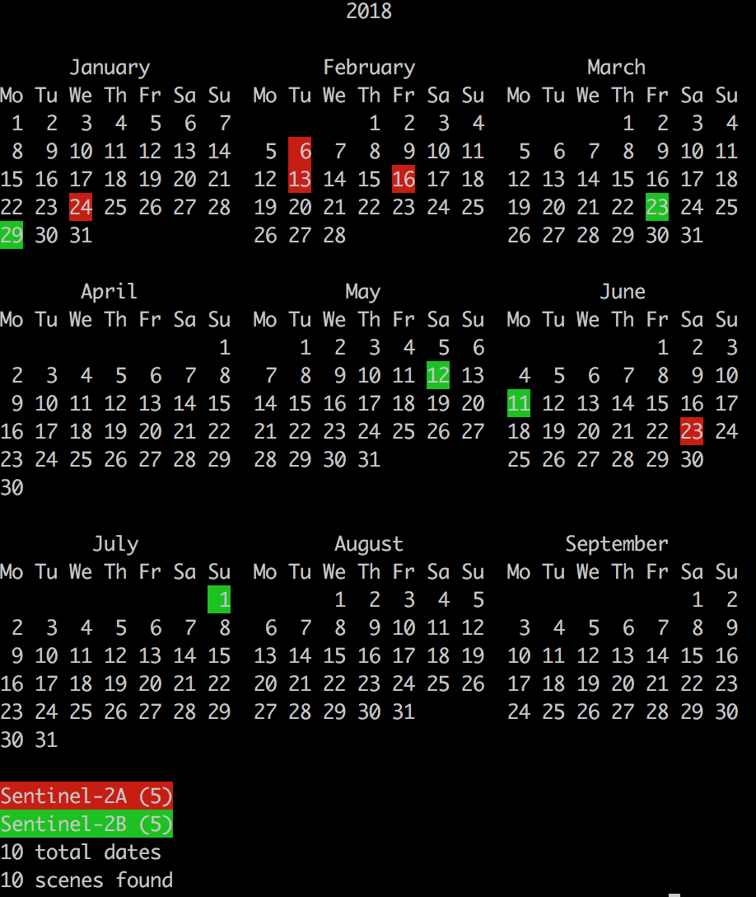

<div>Finding and using public earth imagery with sat-utils</div>
<hr />
<div>
    
    <div style="text-align: right; font-size: 80%">
        Matthew Hanson<br />
        @geoskeptic
    </div>
</div>

---

### Workshop Overview 
- Overview of public imagery 
- What is STAC? 
- Searching image metadata 
- Downloading imagery 
- Applications

---

## Earth on AWS https://aws.amazon.com/earth/ 
- Geospatial data stored on AWS S3 
- Open to everyone 
- Copies, not original source 
- Often converted into more friendly formats

----

### Landsat 
- Landsat-8 only
- 5 year archive (since launch) 
- Level 1'
    - Not-quite Top-of-Atmosphere (TOA)
- Cloud-optimized GeoTIFFs 
- Bands separated by file 
- Revisit Rate: 16 days
- 30m resolution

----

### Sentinel 
- Sentinel-2A launched mid-2015
- Sentinel-2B launched mid-2017
- Level 1C
    - Top-of-Atmosphere reflectance 
- JPEG2000 
- Bands seperated by file 
- Revisit rate: 10 days each (5 days with both!) 
- Requestor Pays bucket

----

## The State of satellites
https://landscape.satsummit.io/ 
- Overview of current satellites specifications
- Example applications

---

## Metadata first
With growth of satellite data, how do we... 
- catalog imagery for easy discovery? 
- minimize sensor specific searches? 
- avoid having directory of images files and not knowing their source?

----

## STAC
new specification for data providers to... 
- use common names for fields 
- describe their imagery 
- provide consistent API

----

## What is STAC?
Spatio-Temporal Asset Catalog

#### metadata
- set of standard fields for geospatial data

#### catalog
- linked flat files of STAC \`Items\` that can be crawled

#### api
- REST API for querying geospatial data

https://github.com/radiantearth/stac-spec/

----

## A common core: "Where and When" 

| element | description |
|-----------------|-----------------| 
| id | Provider ID for the item | 
| geometry | Bounding Box + Footprint of the item in lat/long (EPSG 4326) | 
| datetime | The searchable date/time of the assets, in UTC (Formatted in RFC 3339) | 
| provider | Provider name | 
| license | Item's license name based on SPDX License List or following guidelines for non-SPDX licenses |
| links | Array of link objects to resources and related URLs (self required) |
| assets | Dictionary of asset objects that can be be download |

----

## Electro-Optical (EO) extension

| element | description |
|----------------------|---------------------------|
| eo:gsd | The minimum distance between pixel centers available, in meters |
| eo:platform | Specific name of the platform (e.g., landsat-8, sentinel-2A, larrysdrone) |
| eo:instrument | Name of instrument or sensor (e.g., MODIS, ASTER, OLI, Canon F-1) |
| eo:epsg | EPSG code of the data SRS, null if no crs |
| eo:cloud_cover | Percent of cloud cover (1-100) |
| eo:off_nadir | Viewing angle. 0-90 degrees, measured from nadir |
| eo:azimuth | Viewing azimuth angle. 0-360 degrees, measured clockwise from north |
| eo:sun_azimuth | Sun azimuth angle. 0-360 degrees, measured clockwise from north |
| eo:sun_elevation | Sun elevation angle. 0-90 degrees measured from horizon |
| eo:bands | Band specific metadata (see below) |

----

#### assets and eo:bands
```json
"eo:bands": { 
    "B1": { 
        "common_name": "blue", 
        "gsd": 30, 
        "center_wavelength": 0.48, 
        "full_width_half_max": 0.06 },
    "B2": { 
        "common_name": "green", 
        "gsd": 30, 
        "center_wavelength": 0.56, 
        "full_width_half_max": 0.06 },
    "B3": {
        "common_name": "red",
        "gsd": 30,
        "center_wavelength": 0.65,
        "full_width_half_max": 0.04 },
    "B4": {
        "common_name": "pan", 
        "gsd": 15, 
        "center_wavelength": 0.59, 
        "full_width_half_max": 0.18 } 
```
```json
"assets": {
    "datafile": {
        "href": "url/to/datafile",
        "eo:bands": [ "B3", "B2", "B1" ] },
    "panband": {
        "href": "url/to/panbandfile",
        "eo:bands": [ "B4" ] }
```

----

### Spectral Bands

| Common Name     | Band Range (μm) | Landsat 5 | Landsat 7 | Landsat 8 | Sentinel 2 | MODIS |
|----------------------|---------------------------|-------------------------|---------------------------------------------------------------------------------------------|------------------------------------|------------------------------------|------------------------------------|
| Coastal |  0.40 - 0.45 |      |            |     1    |     1    |            
|Blue    |  0.45 - 0.5 |  1    |      1     |     2    |     2    |       3    
|Green   |  0.5 - 0.6  |  2    |      2     |     3    |     3     |      4    
|Red     |  0.6 - 0.7  |  3    |      3     |     4    |     4      |     1    
|Pan     |  0.5 - 0.7  |       |      8    |     8     |            |         
|NIR     |  0.77 - 1.00 | 4    |      4     |     5     |    8       |    2    
|Cirrus  |  1.35 - 1.40 |       |           |     9     |    10      |    26   
|SWIR16    | 1.55 - 1.75 | 5     |     5     |     6    |     11     |     6    
|SWIR22     |2.1 - 2.3  |  7     |     7     |     7     |    12     |     7        
|LWIR   | 10.5 - 12.5 |   6    |     6      |     10, 11     |          |      31, 32

----

### Band Combinations

| Combination Name | Band 1 | Band 2 | Band 3 |
| --- | --- | --- |
| Natural Color | red | green | blue |
| Urban False Color | swir22 | swir16 | red |
| Agriculture | nir | red | green |
| Atmospheric Penetration | swir22 | swir16 | nir |
| Healthy Vegetation | nir | swir16 | blue |
| Land/Water | nir | swir16 | red |
| Natural With Atmospheric Removal | swir22 | nir | green |
| Vegetation Analysis | swir16 | nir | red |

---

### sat-api as a dynamic STAC API 
- STAC compliant 
- *warning*: upcoming changes
    - watch http://medium.com/devseed
- all landsat-8 and sentinel-2 scenes on AWS
    - 6+ million records 
- returns a GeoJSON FeatureCollection
- Written in Node 
    - AWS Infrastructure 
    - APIGateway, Lambda, ElasticSearch 
    - Easily deployable with CloudFormation


https://sat-api.developmentseed.org/search/stac

----

## Landsat Examples

Item

<div style="font-size: 70%">https://sat-api.developmentseed.org/search/stac?id=LC08_L1TP_026009_20150729_20170406_01_T1</div>

Collection

<div style="font-size: 70%">https://sat-api.developmentseed.org/collections/landsat-8-l1/definition</div>

----

## Using sat-api 
- Search on any property 
- Partial datetimes supported 
- Range searches on numerics using a / (forward slash)

Two pass search
1. search the collections
    - match on matching field OR missing field
2. search the items
    - match items within any collection from step 1 - match on matching fields OR missing field

---

## Let's explore sat-api 
- Install JSONView browser extension Main search endpoint

<div style="font-size: 70%"> https://sat-api.developmentseed.org/search/stac </div>

Landsat-8 scenes from 2017 with 0-20% cloud cover
<div style="font-size: 70%"> https://sat-api.developmentseed.org/search/stac?datetime=2017&c:id=landsat-8-l1&eo:cloud_cover=0/20 </div>

All scenes between Dec 31 2017 and Jan 1 2018
<div style="font-size: 70%"> https://sat-api.developmentseed.org/search/stac?datetime=2016-12-31/2017-01-01 </div>

---

## sat-utils
https://github.com/sat-utils
Utilities(libs/CLIs) for finding and fetching imagery 
- sat-api: explored above 
    - https://github.com/sat-utils/sat-api 
- sat-search: client search tool 
    - https://github.com/sat-utils/sat-search 
- sat-fetch: client imagery fetch tool 
    - https://github.com/sat-utils/sat-fetch
- sat-gbdx: coming soon

Major releases after STAC 0.6.0

----

# sat-search 
- Install via pip (Python2.7, Python3.6)
```
$ pip install satsearch==1.0.0rc3
$ sat-search -h
$ sat-search search -h
```
- Now, let's create an Area of Interest (AOI)
    - http://geojson.io
    - Or, use one you already have
    - Keep it somewhat small, size of a city

----

#### Searching imagery Search for Landsat-8 imagery in your AOI
```
$ sat-search search --intersects aoi.geojson -c landsat-8-l1
```
Search for Landsat-8 imagery in 2016 for AOI
```
$ sat-search search --intersects aoi.geojson -c landsat-8-l1  --datetime 2016-01-01/2016-12-31 --print_cal
```
Limit to cloud cover < 20%
```
$ sat-search search --intersects aoi.geojson -c landsat-8-l1  --datetime 2016-01-01/2016-12-31 --eo:cloud_cover 0/20  --print_cal
```
Print date and scene IDs of matching scenes
```
$ sat-search search --intersects aoi.geojson -c landsat-8-l1  --datetime 2016-01-01/2016-12-31 --print_md
```

----

### Saving results for later
Search for matching scenes and save to GeoJSON file
```
$ sat-search search --intersects aoi.geojson -c landsat-8-l1  --datetime 2016-01-01/2016-12-31 --eo:cloud_cover 0/20  --save results.geojson
```
Load results and print calendar
```
$ sat-search load results.geojson --print_cal
```
Load results and download thumbnails
```
$ sat-search load results.geojson --download thumbnail
```

---

### sat-fetch
- Works just like sat-search 
- Downloads imagery for just AOIs, not entire tiles 
- Requires GDAL
<hr />
#### Using sat-fetch with docker

```
$ docker run --rm -v $PWD:/home/geolambda/work \
    -it developmentseed/sat-fetch /bin/bash
$ cd work
$ sat-fetch load aoi.geojson --download red green blue
```

---

## Ngorongoro Crater


----

## Landsat-8
```
sat-search search 
    \ --intersects ngorongoro.geojson --eo:cloud_cover 0/5 \
    -c landsat-8-l1 --save landsat-scenes.geojson \
    --print_md date eo:cloud_cover id
```
```
date        eo:cloud_cover  id 
2013-09-03  0               LC08_L1TP_169062_20130903_20170502_01_T1
2014-01-25  0               LC08_L1TP_169062_20140125_20170426_01_T1 
2014-02-26  2               LC08_L1TP_169062_20140226_20170425_01_T1 
2014-11-25  1               LC08_L1TP_169062_20141125_20170417_01_T1 
2014-12-11  5               LC08_L1TP_169062_20141211_20170416_01_T1 
2015-01-28  1               LC08_L1TP_169062_20150128_20170413_01_T1 
2015-02-13  0               LC08_L1TP_169062_20150213_20170413_01_T1 
2015-08-24  2               LC08_L1TP_169062_20150824_20170405_01_T1 
2015-09-09  1               LC08_L1TP_169062_20150909_20170404_01_T1 
2015-12-30  0               LC08_L1TP_169062_20151230_20170331_01_T1 
2016-02-16  0               LC08_L1TP_169062_20160216_20180526_01_T1 
2016-08-10  2               LC08_L1TP_169062_20160810_20170322_01_T1 
2016-10-13  0               LC08_L1TP_169062_20161013_20180526_01_T1 
2016-10-29  3               LC08_L1TP_169062_20161029_20170319_01_T1 
2017-01-17  0               LC08_L1TP_169062_20170117_20170311_01_T1 
2017-11-17  2               LC08_L1TP_169062_20171117_20171122_01_T1 
2018-02-05  0               LC08_L1TP_169062_20180205_20180221_01_T1 
2018-05-28  3               LC08_L1TP_169062_20180528_20180605_01_T1 
18 scenes found
```

----

### fetching Landsat 
```
$ time sat-fetch load landsat-scenes.geojson \
    --download red green blue
real 0m59.674s 
```
<div class="fragment" style="position:absolute"></div>

----

## Sentinel-2 
```
$ sat-search search \
    --intersects ngorongoro.geojson --eo:cloud_cover 0/5 \
    -c sentinel-2-l1c --datetime 2018-01-01/2018-08-30 \
    --save ngorongoro-sentinel-scenes.geojson --print_cal 
```


----

## fetching Sentinel-2 
```
$ time sat-fetch load sentinel-scenes.geojson \
    --download red green blue
real 8m6.525s 
```
<div class="fragment" style="position:absolute"></div>


---

### Remote vs Local Procesing
When should I download datafile and process locally? 
- If bounding box of your AOI is > 25% of a scene 
- If you plan on accessing image more than once
    - *But*, this also depends on 
    - How data is stored (COG, JP2K, compression) 
- Where are you processing
    - local, cloud machine close to data (in-region)?
- Do you want to minimize egress costs?

---

## What's next ? 
- keep updating to keep pace with STAC specification 
- add more public datasets 
- first major release after STAC 0.6.0 release 
- develop other sat-util applications for processing from metadata first

----

## Under Development 
- sat-gbdx
    - STAC command line wrapper around Digital Globe's catalog 
- sat-process
    - like sat-fetch but apply operations when fetching 
    - linear stretching, band indices, pan-sharpening, etc. 
    - sat-class - process STAC Items with scikit-learn - unsupervised and supervised classification
