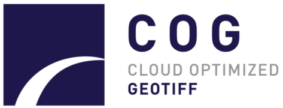
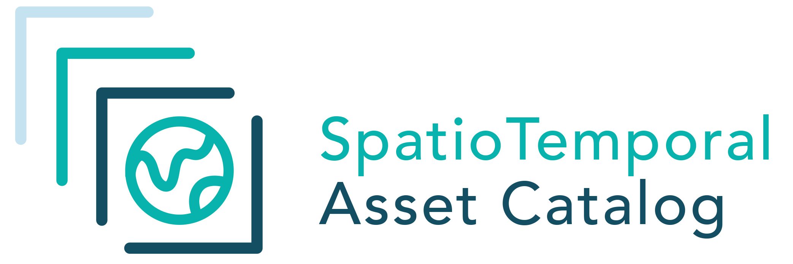

How Open Communities are Revolutionizing Science

    
    

    

        Matthew Hanson 
        @GeoSkeptic 
         
    

     
    
@element84

Notes:
- Hello, name, company
- NH, shortest coastline of any state, 28 km
   - much shorter than neighboring Maine, which has longer seacoast than California
- the seacoast = NH

----

Big EO Data

Note:
- Thanks to BLOC for hosting
- Vasile invitation to give keynote because of exp with big EO data
- Tell story of personal journey through a history of FOSS4G
- A ceveat: my own exp, tell me where I'm wrong

----

"How Open is revolutionizing science"

"How Open Ideas are revolutionizing science"

"How Open Software/Data/Standards are revolutionizing science"

"How Open (.*) is revolutionizing science"

Notes:
- I played with a few variations of a title
- Free exchange of ideas 
- thought, talked with lots of folks
- except...I eventually realized

----

Except...it's about the communities

software, data, and standards do not create themselves

Notes:
- it's the communities that create these
- great ideas and solutions go nowhere without a community to promote them

----

Looking back...

Notes:
- Career has largely been about helping make science easier, for scientists
- analytics

---

### 1995 - 2010

remote sensing in government

- multispectral and hyperspectral exploitation
- material mapping and synethetic scene modeling
- object detection and identification
- image registration and geolocation

Notes:
- algorithm development
- governments owned and operated satellites
- used by governments and scientists, not industry, not tech community

----

### FOSS4G

2010 and earlier

Notes:
- Birth of the FOSS4G movement in that decade
- OSGeo formed 2006
- The first FOSS4Gs
- Most Scientists and governments were users
    - but a few were contributors and creators
- Inception and rise of several important projects

---

### 2011

pivot to earth science
@ Applied Geosolutions

- climate science
- agriculture
- forestry
- soil carbon models

Notes:
- very small company
  - not to be confused with AppGeo in Boston, or GeoSolutions in Italy
- scientific processing pipelines
- implementing science code as someone who knew about remote sensing and software
- used a lot of geospatial OS
- and so it was

----

vectors and web mapping

Notes:
- remote sensing wasn't a big thing
- don't want to display images
  - can you turn them into vectors?
  - with vectors you can do geometric operations
- big impact

----

returned to work thinking of OS role in science

Notes:
- returned to work with fresh look on things
- saw that most time was spent doing non-science
- streamline the process

----

Scientists are messy

----

Data provenance is a luxury

Publishing papers is the goal

---

### 2011 - 2015

earth science

Data: Landsat, Sentinel, MODIS, PALSAR, LiDAR

started contributing

- GeoNode
- GIPPY - Geospatial Image Processing for Python
- GIPS - Geospatial Image Processing System

Notes:
- data management
- Making it easier to download open data and create Analysis Ready Data
  - surface reflectance, and cloud-masked products
- L8/L7/L5 and S2 not available as SR
- toward the end of my time at this company...

----

satellite imagery

the rise of smallsats

Notes:
- Planet launches Doves (2013) - promise of daily fairly high res
- Landsat-8 launched (2013) - big deal
- thoughts of regular raster data
- Low-cost drones
- Paying attention to science, scientific track at FOSS4G was a thing
- Momentum increased over the next year

----

Notes:
- landsat5 extended life span, but some regions not covered
  - archiving responsibility of local ground stations
- landsat6 ruptured fuel chamber, caused tumbling, failed to achieve orbit
- disasters were not over

----

Notes:
- launched April 1999
- SLC failure May 31, 2003
- More pronounced at edges of scene, complete at center
- made very difficult to use

----

”You are awesome, your software is awesome, [but] your software is useless, …without data”.” 

- Schuyler Erle, 2010

Notes:
- Talking primarily about OSM at the time
- Well, now we had data
  - OS community of developers in industry started seeing what they could do with it

----

Notes:
- Explosion of open data
- Landsat-8 (2013)
- Sentinel-2A (2015)
- OpenAerialMap

----

in search of the golden basemap

Notes:
- imagery was now available
- interest in combinining imagery to generate 
  - timeline and season dependent basemaps

----

Consuming Big Data

Notes:
- FOSS4G community set to work on improving consumption
- web mapping services for viewing, not for science
- Started talking about cloud native formats
   - to efficiently view data
   - only access data you want

---

### 2016 - 2019

make remote sensing easier

- International development @developmentseed
- Open Standards for interoperability
- Tools and libraries to make data more accessible

Notes:
- Working for development seed, using sat imagery and mapping international dev
- Users were now non-scientists
- wanted insights and info derived from
- analytics and algorithms are cool, but harder than it needed to be
- wanted to improve the situation, make it easier to use...correctly
  - still a ways to go

----

sat-utils

- landsat-util
- sat-api
- indexing of AWS Public Datasets
  - Landsat-8 and Sentinel-2

Notes:
- L8 and S2 had different sets of metadata
- I wanted to make them consistent but didn't have time

----

machine-learning

Notes:
- moving beyond the basemap to analytics
- talked about ML as it if were new
- Data scientists
- how to derive info, through ML pipelines - analytics
    - agriculture
    - climate change
    - economics
    - international development

---

### We have made great progress

accessing at scale

processing at scale

----

discoverability at scale is still a problem

Notes:
- Too much data, how do we know what to run it on
- How do we do it programmatically?
- ML and analytics pipelines

----

”You are awesome, your software is awesome, [but] your software is useless, …without ~data~ metadata”” 

----

### If your metadata cannot be crawled and indexed, your data does not exist

Notes:
- At least it cannot be found and used, so might as well not exist

----

SpatioTemporal Asset Catalogs

https://stacspec.org/

See my talk on "STAC and OS Software" from Friday morning

Notes:
- First STAC sprint tail end of SoTM US 2017 in Boulder
- solution to sat-utils

----

sat-utils supports STAC

https://github.com/sat-utils/

----

### There's additional problems as well

- misuse of data
- poor understanding of remote sensing

Industry misusing data

Landsat TOA'

Science Data Handbook

Notes:
- Industry saw influx of open data
- started using it
- poor understanding of accuracy and uncertainty
- remote sensing is difficult and complicated

----

Notes:
- Most users likely never cracked open the handbook

----

Notes:
- TOA prime
- End users fetch data and calculate NDVI
  - arguable to use it as TOA

----

#### Users assume that data is analysis ready

Notes:
- L8/S2 still not available in cloud native formats as surface refl
- especially when it went up on AWS

----

### Analysis Ready Data Community

Notes:
- the answer is standards
- users should not have to process each type of data in different ways
- how can we mix and fuse data from different sensors or sensor modalities
- need to rely on scientific community to determine what is possible and what isn't

---

## Scientific Problems

- Scalability
- Reproducibility
- Academic IP

- Coding skills
  - "spaghetti" code
  - poor data management
    - data provenance

Notes:
- But, scientific community had problems of their own
- Scientists spaghetti code
- poor data management
- not reproducible
- not necessarily know about the cloud and efficent computing
- hard to change scientists methods

----

"Open Source" vs publicly available software

Notes:
- The difference between usable OSS and code that's thrown up there

----

## Pangeo

http://pangeo.io

Pangeo is a community first

Notes:
- But all is not lost
- Platforms come and go, communities have inertia

----

Pangeo is first and foremost a community promoting open, reproducible, and scalable science

----

The Pangeo project serves as a coordination point between scientists, software, and computing infrastructure

----

Pangeo Goals

1. Foster collaboration around the open source scientific python ecosystem for ocean / atmosphere / land / climate science.
2. Support the development with domain-specific geoscience packages.
3. Improve scalability of these tools to handle petabyte-scale datasets on HPC and cloud platforms.

Notes:
- Executable papers

----

Pangeo Example

----

Open Source Software

Open Standards

Open Data

Open Science

Notes:
- This is now possible with open

---

@GeoSkeptic

@Element84