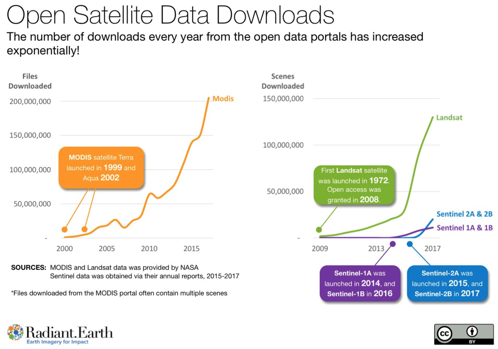

How Open Communities are Revolutionizing Science

    
    

    

        Matthew Hanson 
        @GeoSkeptic 
         
    

     
    
@element84

Notes:
- Hello, name, company
- NH, shortest coastline of any state, 28 km
   - much shorter than neighboring Maine, which has longer seacoast than California
- the seacoast = NH

----

Big EO Data

Note:
- Thanks to BLOC for hosting
- Vasile invitation to give keynote because of exp with big EO data
- Tell story of personal journey through a history of FOSS4G
- A ceveat: my own exp, tell me where I'm wrong

---

"How Open is revolutionizing science"

"How Open Ideas are revolutionizing science"

"How Open Software/Data/Standards are revolutionizing science"

"How Open (.*) is revolutionizing science"

Notes:
- I played with a few variations of a title
- thought long, hard, talked with lots of folks
- except...I eventually realized

---

Except...it's about the communities

software, data, and standards do not create themselves

Notes:
- it's the communities that create these

----

Looking back...

Notes:
- Career has largely been about helping make science easier, for scientists
- analytics

---

### 1995 - 2010

remote sensing in government

- multispectral and hyperspectral exploitation
- material mapping and synethetic scene modeling
- object detection and identification
- image registration and geolocation

Notes:
- algorithm development
- governments owned and operated satellites
- used by governments and scientists, not industry, not tech community

----

### FOSS4G

2010 and earlier

Notes:
- Birth of the FOSS4G movement in that decade
- The first FOSS4Gs
- Most Scientists and governments were users
    - but a few were contributors and creators
- Inception and rise of several important projects

---

### 2011

pivot to earth science @ Applied Geosolutions

- climate science
- agriculture
- forestry
- soil carbon models

Notes:
- very small company
  - not to be confused with AppGeo in Boston, or GeoSolutions in Italy
- scientific processing pipelines
- implementing science code as someone who knew about remote sensing and software
- used a lot of geospatial OS
- and so it was

----

vectors and web mapping

Notes:
- remote sensing wasn't a big thing
- don't want to display images
  - can you turn them into vectors?
  - with vectors you can do geometric operations
- big impact

----

returned to work thinking of OS role in science

Notes:
- returned to work with fresh look on things
- saw that most time was spent doing non-science
- streamline the process

----

Scientists are messy

----

Data provenance is a luxury

Publishing papers is the goal

---

### 2011 - 2015

earth science

Data: Landsat, Sentinel, MODIS, PALSAR, LiDAR

started contributing

- GeoNode
- GIPPY - Geospatial Image Processing for Python
- GIPS - Geospatial Image Processing System

Notes:
- data management
- Making it easier to download open data and create Analysis Ready Data
  - surface reflectance, and cloud-masked products
- L8/L7/L5 and S2 not available as SR
- toward the end of my time at this company...

----

satellite imagery

the rise of smallsats

Notes:
- Planet becomining visible (2013)
- Landsat-8 launched (2013)
- thoughts of regular raster data
- Paying attention to science, scientific track at FOSS4G was a thing
- Things were in full swing by...

----

in search of the golden basemap

Notes:
- imagery was now available
- interest in combinining imagery to generate 
  - timeline and season dependent basemaps
- Why was Planet such a big thing
- But first, why was landsat-8 such a big thing

----

Notes:
- landsat6 ruptured fuel chamber, caused tumbling, failed to achieve orbit

----

Notes:
- SLC failure May 31, 2003
- More pronounced at edges of scene, complete at center

----

”You are awesome, your software is awesome, [but] your software is useless, …without data”.” 

- Schuyler Erle, 2010

Notes:
- Talking primarily about OSM at the time
- Well, now we had data
  - OS community of developers in industry started seeing what they could do with it

----

Notes:
- Explosion of open data
- Landsat-8 (2013)
- Sentinel-2A (2015)
- Drones
- OpenAerialMap

----

The Cloud

- Cloud formats (COG)
- Focus on consuming data efficiently

Notes:
- Started talking about cloud native formats
- Focus on how to consume data

---

### 2016 - 2019

make remote sensing easier

- International development @developmentseed
- Open Standards for interoperability
- Tools and libraries to make remote sensing accessible

Notes:
- Working for development seed, variety of projects in international dev
- Users were now non-scientists
- wanted insights and info derived from
- wanted to improve the situation, make it easier to use...correctly
  - still a ways to go
- analytics and algorithms are cool, but harder than it needed to be

----

machine-learning

Notes:
- Data scientists
- moving beyond the basemap to analytics
- big EO data
- how to access at scale
- how to process at scale
- how to derive info, through ML pipelines - analytics
    - agriculture
    - climate change
    - economics
    - international development
- tech world turning to science

----

### Industry Problems

- misuse of data
- poor understanding of remote sensing

Industry misusing data

Landsat TOA'

Science Data Handbook

Notes:
- Industry saw influx of open data
- started using it
- poor understanding of accuracy and uncertainty

----

Notes:
- Most users likely never cracked open the handbook

----

Notes:
- TOA prime

----

#### Users assumed that data was analysis ready

Notes:
- remains true to this day
- L8/S2 still not available cloud native formats as surface refl

---

## Open Standards

- Standards so far based on how data consumed
   - Web standards for consuming tiles
- STAC
- ARD

----

#### ”You are awesome, your software is awesome, [but] your software is useless, …without metadata”.” 

----

#### If your metadata cannot be crawled and indexed, your data might as well not exist

----

SpatioTemporal Asset Catalogs

https://stacspec.org/

"STAC and OS Software"

Friday 9AM in Ronda Ballroom

----

### Analysis Ready Data

---

- Developer-Scientists
  - getting more savvy in use and cool results
  - still issues with understanding uncertainties
  - not sure how to mix and fuse data
  - what is analysis ready data anyway?

- 2017 - Machine Learning

----

### Industry needs to turn more to scientists

Notes:
- But they have their problems as well

---

## Scientific Problems

- Scalability
- Reproducibility
- Academic IP

- Coding skills
  - "spaghetti" code
  - poor data management
    - data provenance

Notes:
- Meanwhile, scientific community had problems of their own
- Scientists spaghetti code
- poor data management
- not reproducible

---

## Remote sensing is hard

- The problem with science
  - papers
  - historical analysis of big data limited
  - difficult to reproduce
  - remote sensing is hard and error prone

Notes:
- Scientific community turning to the Open Communities
  - not necessarily know about the cloud and efficent computing
  - hard to make changes

----

----

---

- Open Source Software
  - OS software history has helped make scientists jobs easier
  - Consumers, not producers

- "Open-Source" vs Open-Source

Notes:
- Scientific community as consumers of OS
- Rarely would contribute back
  - Not developers

----

## Pangeo

http://pangeo.io

Pangeo is a community first

Notes:
Platforms come and go, communities have inertia

---

@GeoSkeptic

