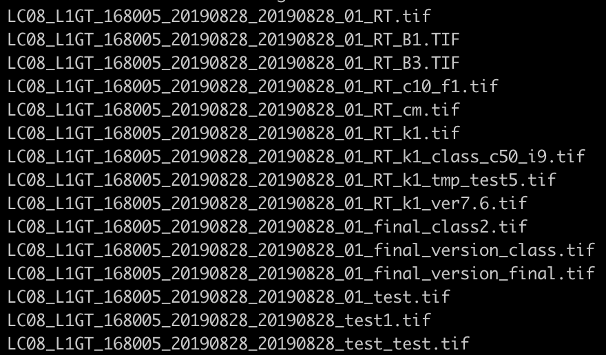

How Open Communities are Revolutionizing Science

    
    

    

        Matthew Hanson 
        @GeoSkeptic 
         
    

     
    
@element84

Notes:
- Hello, name, company

----

Big EO Data

Note:
- Thanks to BLOC for hosting, accomadating 
- Vasile invitation to give keynote because of exp with big EO data
- Tell story of personal journey, which iincludes history of FOSS4G through my eyes

----

"How Open is revolutionizing science"

"How Open Ideas are revolutionizing science"

"How Open Software/Data/Standards are revolutionizing science"

"How Open (.*) is revolutionizing science"

Notes:
- I played with a few variations of a title
- Free exchange of ideas 
- thought, talked with lots of folks
- except...I eventually realized

----

Except...it's about the communities

software, data, and standards do not create themselves

Notes:
- it's the communities that create these
- great ideas and solutions go nowhere without a community to promote them

----

Looking back...

Notes:
- Career has largely been about helping make science easier, for scientists
- analytics and algorithm dev
  - always spent more time doing data preparation
  - interesting analytics work always seemed harder than it needed it be

---

### 1995 - 2010

remote sensing in government

- multispectral and hyperspectral exploitation
- material mapping and synethetic scene modeling
- object detection and identification
- image registration and geolocation

Notes:
- background early 90s in photographic science, transition period of film to consumer digital
- remote sensing and image processing
- self taught software development
- algorithm development
- governments owned and operated satellites
- used by governments and academia, not industry, not tech community

----

### FOSS4G

2010 and earlier

Notes:
- government consumers, not contributors
- Birth of the FOSS4G movement in that decade
- OSGeo formed 2006
- The first FOSS4Gs
- Inception and rise of several important projects, still in use

---

### 2011

pivot to earth science
@ Applied Geosolutions

- climate science
- agriculture
- forestry
- soil carbon models

Notes:
- very small company
  - not to be confused with AppGeo in Boston, or GeoSolutions in Italy
- scientific processing pipelines
- implementing science code as someone who knew about remote sensing and software
- used a lot of geospatial OS
- and so it was

----

vectors and web mapping

Notes:
- remote sensing wasn't a big thing
- yes, lots of OS software for dealing with rasters
- mostly era of web mapping and vector data
- don't want to display images
  - can you turn them into vectors?
  - with vectors you can do geometric operations
- big impact

----

returned to work thinking of OS role in science

Notes:
- returned to work with fresh look on things
- saw that most time scientists spent doing non-science
- looked to streamline the process

----

Scientists are messy

Notes:
- scientists were poor at data management
- typical work directory, with hapharzardly named files
- don't know what was source, final product
- no one but the scientist really knew what was going on
  - made replication difficult

----

Data provenance was a luxury

Publishing papers is the goal

Notes:
- provenance seen as a luxury, no time for

---

### 2011 - 2015

earth science

Data: Landsat, Sentinel, MODIS, PALSAR, LiDAR

started contributing

- GeoNode
- GIPPY - Geospatial Image Processing for Python
- GIPS - Geospatial Image Processing System

Notes:
- hduring this time worked a lot with open data
- started contributing to GeoNode to manage some of our data
- set about to tackle problems in data management and pre-processing
- Worked toward making it easier to download open data and create Analysis Ready Data
  - surface reflectance, and cloud-masked products
  - that could be turned into time series
- L8/L7/L5 and S2 not available as SR
- created new OS proects gippy and gips
   - automate and scale up processing large amounts of data on our servers
- toward the end of my time at this company...

----

satellite imagery

the rise of smallsats

Notes:
- just been 3 years, quite a different time
- Planet launches Doves (2013) - which showed a possible future of having daily fairly high res
- starting to see much lower-cost drones
- there was more interest
  - there was now a scientific track at FOSS4G
  - more academics were joining the cult
- Landsat-8 launched (2013) - big deal

----

Notes:
- 1993 landsat6 ruptured fuel chamber, caused tumbling, failed to achieve orbit
- landsat5 extended life span (2012), but some regions not covered
  - archiving responsibility of local ground stations
- disasters were not over
  - L7 launched 1999, and was great

----

Notes:
- after a little over 3 years, 2003, SLC failed
  - piece of hardware compensates for forward movement of craft
- More pronounced at edges of scene, complete at center
- made very difficult to use
- that's why L8 was such a big deal, combine with NASA's Open Data policy

----

Notes:
- so now we had data
  - Landsat-8 (2013)
  - shortly after we had Sentinel-2A (2015)
- use of that data exploded

----

”You are awesome, your software is awesome, [but] your software is useless, …without data”.” 

- Schuyler Erle, 2010

Notes:
- Talking primarily about OSM at the time, certainly applicable here
- there were a bunch of OS tools for rasters
  - the use of those tools also exploded
  - community started looking at what they could do with all this data
- for instance, while GDAL was a long established tool
  - python bindings were awkward, so rasterio was created 

----

in search of the golden basemap

Notes:
- first thing the community was interested
  - use imagery to create vectors (digitization, tracing)
  - make basemaps to display their vector data
  - timeline and season dependent basemaps
- There were challenges due to the large nature of datafiles
  - But, this was also the time that the cloud started taking off

----

Consuming Big Data

Notes:
- FOSS4G community set to work on improving consumption
- web mapping services for viewing, not for science
  - needed the original unscaled image
  - so cloud native formats were very relevant for science
  - you could access the original data alues for any region, without downloading
    - although, still some years for scientists to start taking advantage

---

### 2016 - 2019

make remote sensing easier

- International development @developmentseed
- Tools and libraries to make data more accessible

Notes:
- Working for development seed, using sat imagery and mapping international dev
- Users were now non-scientists
- wanted insights and info derived from
- analytics and algorithms are cool, but still harder than it needed to be
- wanted to improve the situation, make it easier to use...correctly
  - still a ways to go
  - more on "correctly" later

----

sat-utils

https://github.com/sat-utils

- landsat-util
- sat-api
  - public API
  - L8 and S2 data (AWS and GCP)

Notes:
- landsat-util was before my time
  - very successful - search and fetch landsat scenes per band
- sat-api also existed (it's what landsat-util used)
  - L8 and S2
- I started working on building upon these
- One issue was that L8 and S2 had different metadata in sat-api
  - I wanted to make them consistent but didn't have time
- presentation in Bonn, then following year

----

machine-learning

Notes:
- moving beyond the basemap to analytics
- talked about ML as it if were new
  - even though scientists been doing this for years
- Now we had a huge number of Data scientists
- how to derive info, through ML pipelines - analytics
  - not do traditional science (determine what's true from what isn't)
  - use this data to solve problems
    - agriculture
    - climate change
    - international development
    - disaster response
    - to help inform policy

---

### We have made great progress

accessing data at scale

processing data at scale

Notes:
- thanks to community
- thanks to Open Data
- thanks to advances in computing and cloud infrastructure
- But...

----

discoverability at scale is still a problem

Notes:
- Too much data, how do we know what to run it on
- How do we do it programmatically?
  - for ML and analytics pipelines

----

”You are awesome, your software is awesome, [but] your software is useless, …without ~data~ metadata”” 

Notes:
- i think everyone realizes that metadata is important
- there's always been metadata but
- But...

----

### If your metadata cannot be crawled and indexed, your data does not exist

Notes:
- At least it cannot be found and used, so might as well not exist

----

SpatioTemporal Asset Catalogs

https://stacspec.org/

See "STAC and OS Software" talk from Friday morning

Notes:
- First STAC sprint tail end of SoTM US 2017 in Boulder
- solution to sat-utils
- sat-utils is now a collection of STAC related utilities
- more info see talk

----

Notes:
- as an example, pop in an ID and find a scene
- because the catalog of data was crawlable

----

Great progress in Open Standards

- discoverability
- consumption and use

Notes:
- now we've made good progress (NOT DONE)
- STAC is promising
- New OGC API standards

----

Still we have problems 

There is a poor understanding of remote sensing data which limits the value of insights derived from it

Notes:
- good at using ML approaches and analytics
- Deep Learning has proven to be successful in many areas
- So, the tech community saw influx of open data, started using it
  - have done great things at improving showing what can be done with computing
- remote sensing is difficult and complicated
  - lots of sources of variation, over time, over scenes, atmosphere is hard
- poor understanding of accuracy and uncertainty
  - Not just tech community, these are also hard science problems
  - relaying that info from scientists to non-scientists is even harder

----

Notes:
- As example, there's a handbook
  - details of L8, how to use the data
- Most users in tech community likely never cracked it open

----

Notes:
- If they had, they would see that the distributed data is not even Top of Atmosphere
- It is TOA prime
  - solar elevation
  - makes scenes not comparable from day to day or region to region
- End users fetch data and calculate NDVI
  - arguable to use it as TOA
- Not to say no one knows this, companies doing large-scale analysis 
  - but maybe not everyone

----

#### Users assume that data is analysis ready

Notes:
- L8/S2 still not available in cloud native formats as surface refl
- especially when it went up on AWS
  - it was available to the masses

----

### Analysis Ready Data Community

Notes:
- the answer is still standards
- users should not have to process each type of data in different ways
- how can we mix and fuse data from different sensors or sensor modalities
- need to rely on scientific community to determine what is possible and what isn't
- requires more engagement between scientists and software developers
- This ARD initiative is perhaps a way forward to think about
  - what ARD even is
  - how can we communicate corrections, geometric and radiometric uncertainties
  - so non-experts (in remote sensing) are using it in a way that is scientifically consistent
- However, scientists also have problems

---

## Scientific Problems

- Scalability
- Reproducibility
- Academic IP

- Software quality
  - "spaghetti" code
  - data provenance

Notes:
- But, scientific community had problems of their own
- yes, there has been adoption of OS, but not large-scale
- Many scientists still doing things the old way
  - Scientists spaghetti code
  - poor data management
  - unreleased data or software
- this has led to a reproducibility problem
  - 50% of earth science work cannot be reproduced
- The reason why is that
  - scientists do not necessarily know about the cloud and efficent computing
  - and of course, change is hard, and this is cultural
  - as an example

----

"Open Source" vs publicly available software

Notes:
- The difference between usable OSS and code that's thrown up there
- deployment, examples, documentation, software maintenance

----

These ideas are not novel

Notes:
- stated many times
- seen a great many related talks
- But, to be bold I will say that

----

Stop building platforms in search of a user community

Build a user community that will help build a platform

Notes:
- the platform that will help solve their problems
- that's why I'm exicted about one such effort called

----

## Pangeo

http://pangeo.io

Pangeo is first and foremost a community promoting open, reproducible, and scalable science

Notes:
- This is but one, I'm sure there are others with similar goals
- Let's talk and collaborate
- Platforms come and go, communities have inertia

----

The Pangeo project serves as a coordination point between scientists, software, and computing infrastructure

----

### Pangeo Goals

1. Foster collaboration around the open source scientific python ecosystem for ocean / atmosphere / land / climate science.
2. Support the development with domain-specific geoscience packages.
3. Improve scalability of these tools to handle petabyte-scale datasets on HPC and cloud platforms.

----

Notes:
- Jupyter in the cloud
- the data is stored in the cloud in cloud friendly formats
- algorithm is open
- Executable paper
- This was possible because of

----

Open Source Software

Open Standards

Open Data

Open Science

---

@GeoSkeptic

@Element84