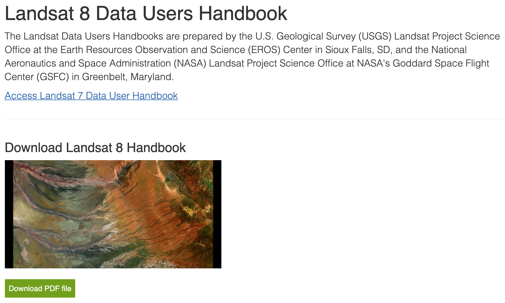

How Open Communities are Revolutionizing Science

    
    

    

        Matthew Hanson 
        @GeoSkeptic 
         
    

     
    
@element84

Notes:
- Hello, name, company

----

Big EO Data

Note:
- Thanks to BLOC for hosting
- Vasile invitation to give keynote on big EO data
- Tell story of personal journey through a history of FOSS4G

---

"How Open is revolutionizing science"

"How Open Ideas are revolutionizing science"

"How Open Software/Data/Standards are revolutionizing science"

"How Open (.*) is revolutionizing science"

Notes:
- I played with a few variations of a title

---

Except...it's about the communities

software, data, and standards do not create themselves

Notes:
- But it's the communities that create these, so that's the important bit
- Let's step back to my early career

----

Thesis: scientists time reducing

Maybe not, but do bigger and better things

---

### 1995 - 2010

remote sensing in government

- multispectral and hyperspectral exploitation
- material mapping and synethetic scene modeling
- object detection and identification
- image registration and geolocation

Notes:
- algorithm development
- governments owned and operated satellites
- used by governments and scientists, not industry

----

### FOSS4G

2010 and earlier

Notes:
- Birth of the FOSS4G movement in that decade
- The first FOSS4Gs
- Inception and rise of several important projects
- Scientists were users, made their jobs easier
- Govenment users, but rarely contributors

---

### 2011

pivot to earth science @ Applied Geosolutions

- climate science
- agriculture
- forestry
- soil carbon models

Notes:
- very small company
  - not to be confused with AppGeo in Boston, or GeoSolutions in Italy
- scientific processing pipelines
- reimplementing science code

----

vectors and web mapping

Notes:
- remote sensing wasn't a big thing
- don't want to display images
  - can you turn them into vectors?
  - with vectors you can do geometric operations

---

# scientists are messy

Notes;
- discovered most time was spent doing non-science

---

### 2011 - 2015

earth science

- Open Data:
    - EO: Landsat, Sentinel, MODIS
    - PALSAR
    - Airborne LiDAR for Biomass estimation
- started contributing
    - GeoNode
    - GIPPY - Geospatial Image Procesing for Python
    - GIPS - Geospatial Image Processing System

Notes:
- data management
- Making it easier to download open data and create ARD
    - atmospheric correction for Landsat, Sentinel

----

satellite imagery

the rise of smallsats

Notes:
- Scientific track

----

### launch of landsat-8

### Landsat-7 SLC

----

in search of the golden basemap

----

”You are awesome, your software is awesome, [but] your software is useless, …without data”.” 

- Schuyler Erle, 2010

Notes:
- Talking primarily about OSM at the time
- Now we had data
  - developers and industry started seeing what they could do with it

---

Without data, there probably isn't software to begin with

Notes:
- Data drives software

---

## Open Data
  - Free data downloads, use

Notes:
- Explosion of open data
- Landsat-8 (2013)
- Sentinel-2A (2015)
- Drones
- OAM
- Started talking about cloud native formats
- Focus on how to consume data
- Mostly scientists still doing analysis

----

Images
- NASA showing use of Landsat images after making public
- Explosion of use on AWS - by non-scientists

---

### 2016 - 2019

make remote sensing easier

- International development @developmentseed
- Open Standards for interoperability
- Tools and libraries to make remote sensing accessible

Notes:
- Working for development seed, variety of projects in international dev
- Users were now non-scientists
- wanted insights and info derived from
- wanted to improve the situation, make it easier to use...correctly
  - still a ways to go
- analytics and algorithms are cool, but harder than it needed to be

---

machine-learning

Notes:
- Data scientists
- moving beyond the basemap to analytics
- big EO data
- how to access at scale
- how to process at scale
- how to derive info, through ML pipelines - analytics
    - agriculture
    - climate change
    - economics
    - international development
- tech world turning to science

---

### Industry Problems

- misuse of data
- poor understanding of remote sensing

Industry misusing data

Landsat TOA'

Science Data Handbook

Notes:
- Industry saw influx of open data
- started using it
- poor understanding of accuracy and uncertainty

----

Notes:
- Most users likely never cracked open the handbook

----

Notes:
- TOA prime

----

#### Users assumed that data was analysis ready

Notes:
- remains true to this day
- L8/S2 still not available cloud native formats as surface refl

---

## Open Standards

- Standards so far based on how data consumed
   - Web standards for consuming tiles
- STAC
- ARD

----

#### ”You are awesome, your software is awesome, [but] your software is useless, …without metadata”.” 

----

#### If your metadata cannot be crawled and indexed, your data might as well not exist

----

SpatioTemporal Asset Catalogs

https://stacspec.org/

"STAC and OS Software"

Friday 9AM in Ronda Ballroom

----

### Analysis Ready Data

---

- Developer-Scientists
  - getting more savvy in use and cool results
  - still issues with understanding uncertainties
  - not sure how to mix and fuse data
  - what is analysis ready data anyway?

- 2017 - Machine Learning

----

### Industry needs to turn more to scientists

Notes:
- But they have their problems as well

---

## Scientific Problems

Scientific Community

Notes:
- Meanwhile, scientific community had problems of their own

- The traditional scientific paper limited in scope
  - Scalability
  - Reproducibility
  - Academic IP

- Scientist coding skills
  - "spaghetti" code
  - poor data management
    - data provenance

*scientists directory

Notes:
- Scientists spaghetti code
- poor data management
- not reproducible

---

## Remote sensing is hard

- The problem with science
  - papers
  - historical analysis of big data limited
  - difficult to reproduce
  - remote sensing is hard and error prone

Notes:
- Scientitic community turning to the Open Communities
  - not necessarily know about the cloud and efficent computing
  - hard to make changes

---

- Open Source Software
  - OS software history has helped make scientists jobs easier
  - Consumers, not producers

- "Open-Source" vs Open-Source

Notes:
- Scientific community as consumers of OS
- Rarely would contribute back
  - Not developers

----

## Pangeo

A community of scientists promoting open

- xarray
- dask

- Executable Papers

---

@GeoSkeptic

