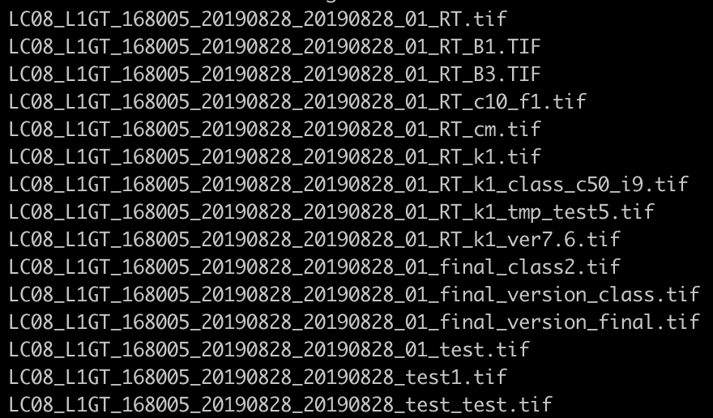
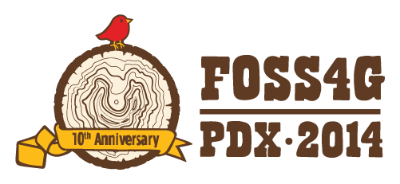
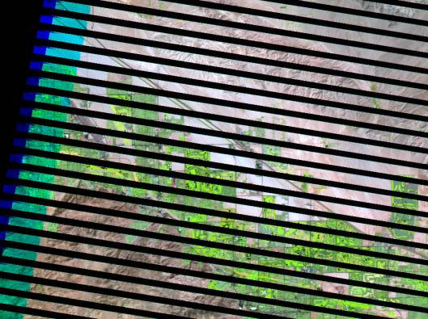
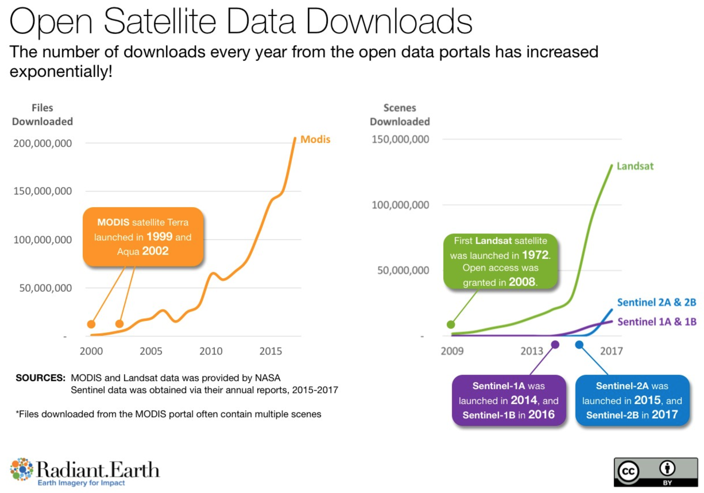
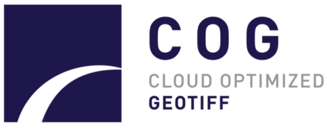
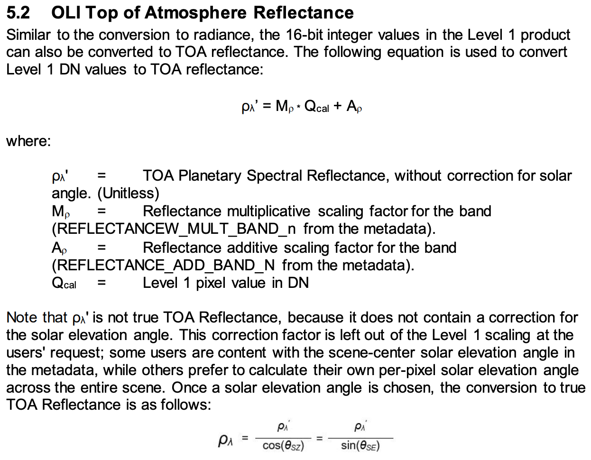
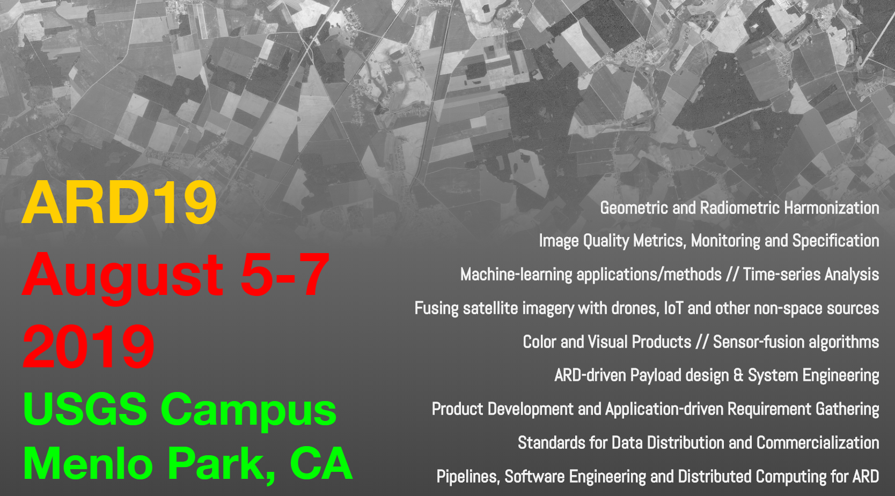

How Open Communities are Revolutionizing Science

Improving Scalability and Reproducibility in the Geo-Sciences with Open Standards, Open Data, and Open Source Software

    

        Matthew Hanson 
        @GeoSkeptic 
         
    

     
    
@element84

Notes:
- Hello, name, company
- Title of talk

----

Notes:
- Used to work with governments and academia, because that's who used sat data
- Career has largely been about helping make science easier, for scientists
- analytics and algorithm dev
  - always spent more time doing data preparation
  - interesting analytics work always seemed harder than it needed it be
- computing application to science
- saw that most time scientists spent doing non-science
- looked to streamline the process

----

 

Notes:
- CMR, Earthdata Search, NASA EOSDIS, Cumulus - moving DAAC into the cloud
- Now, an anecdote...

---

Scientists are messy

Notes:
- scientists were poor at data management
- typical work directory, with hapharzardly named files
- don't know what was source, final product
- no one but the scientist really knew what was going on
  - made replication difficult
- Not their fault - no standards or mechanisms in place to do processing, reporting
- Lots of problems here
  - concern about scenes (how they are distributed)
  - concern of bands
  - processing and documentation
  - what should be archived?  What should be documented?  How does someone reproduce this?

----

Data provenance is a luxury

Publishing papers is the goal

Notes:
- provenance seen as a luxury, no time for
- it's a luxury because it's difficult, dearth of tools, standards to facilitate that

----

Efforts underway to solve these problems

Notes:
- first, let's take go back 5 years when there was a sea change

---

the rise of remote sensing data

Notes:
- just been 3 years since last one, quite a different time
  - previous FOSS4G had been web-mapping
- Planet launches Doves (2013) - which showed a possible future of having daily fairly high res
- starting to see much lower-cost drones
- Perhaps most importantly, Landsat-8 launched (2013) - why is this such a big deal

----

Notes:
- 1993 landsat6 ruptured fuel chamber, caused tumbling, failed to achieve orbit
- landsat5 extended life span (2012), but some regions not covered
  - archiving responsibility of local ground stations
- disasters were not over
  - L7 launched 1999, and was great

----

Notes:
- after a little over 3 years, 2003, SLC failed
  - piece of hardware compensates for forward movement of craft
- More pronounced at edges of scene, complete at center
- made very difficult to use
- that's why L8 was such a big deal, combine with NASA's Open Data policy

----

Notes:
- so now we had data
  - Landsat-8 (2013)
  - shortly after we had Sentinel-2A (2015)
- Open data policies (USGS, NASA, ESA)
- use of that data exploded
- guess what, no longer governments and academia using the data
- Now we had a huge number of Data scientists
- how to derive info, through ML pipelines - analytics
  - not do traditional science (determine what's true from what isn't)
  - use this data to solve problems
    - agriculture
    - climate change
    - international development
    - disaster response
    - to help inform policy

---

Consuming Big Data

Notes:
- observations on big data
- NISAR 80TB/day
- cannot do this locally

----

Notes:
- FOSS4G community set to work on improving consumption
- web mapping services for viewing, not for science
  - needed the original unscaled image
  - so cloud native formats were very relevant for science
  - you could access the original data alues for any region, without downloading

----

<insert slides here>

----

Cloud Native Geospatial Data Formats

- Cloud Optimized GeoTiff (COG)
- JPEG2000
  - excellent compression
  - intensive encoding/decoding
- TileDB
  - New on the scene, GDAL driver
- Zarr

Notes:
- Different formats

----

Open Data sets

AWS: https://registry.opendata.aws/

Google: https://tinyurl.com/y4tn5pon

Microsoft Azure: https://tinyurl.com/y2ae882p

Notes:
- cloud providers started making datasets available on their storage
- incentivize processing on their systems
- it's working, as new public datasets are added
  - icesat2 ?
  - LENS, CMIP6 ?

---

Discovering Big Data

Notes:
- Too much data, how do we know what to run it on
- How do we do it programmatically?
  - for ML and analytics pipelines

----

### If your metadata cannot be crawled and indexed, your data does not exist

Notes:
- At least it cannot be found and used, so might as well not exist

----

SpatioTemporal Asset Catalogs

https://stacspec.org/

Notes:
- talk on STAC: https://docs.google.com/presentation/d/13wuBZWbjxD9aite2O-Bf2m9CNTakh_OVAueIlyM1Buw/edit?usp=sharing

----

Notes:
- as an example, pop in an ID and find a scene
- because the catalog of data was crawlable

---

Great progress in Open Standards

- discoverability
- consumption and use

Notes:
- On our way to solving some challenges

----

Still we have problems 

There is a poor understanding of remote sensing data which limits the value of insights derived from it

Notes:
- Data Science
- good at using ML approaches and analytics
- Deep Learning has proven to be successful in many areas
- So, the tech community saw influx of open data, started using it
  - have done great things at improving showing what can be done with computing
- remote sensing is difficult and complicated
  - lots of sources of variation, over time, over scenes, atmosphere is hard
- poor understanding of accuracy and uncertainty
  - Not just tech community, these are also hard science problems
  - relaying that info from scientists to non-scientists is even harder

----

Notes:
- As example, there's a handbook
  - details of L8, how to use the data
- Most users in tech community likely never cracked it open

----

Notes:
- If they had, they would see that the distributed data is not even Top of Atmosphere
- It is TOA prime
  - solar elevation
  - makes scenes not comparable from day to day or region to region
- End users fetch data and calculate NDVI
  - arguable to use it as TOA
- Not to say no one knows this, companies doing large-scale analysis 
  - but maybe not everyone

----

#### Users assume that data is analysis ready

Notes:
- L8/S2 still not available in cloud native formats as surface refl
- especially when it went up on AWS
  - it was available to the masses

----

### Analysis Ready Data Community

Notes:
- the answer is still standards
- users should not have to process each type of data in different ways
- how can we mix and fuse data from different sensors or sensor modalities
- need to rely on scientific community to determine what is possible and what isn't
- requires more engagement between scientists and software developers
- This ARD initiative is perhaps a way forward to think about
  - what ARD even is
  - how can we communicate corrections, geometric and radiometric uncertainties
  - so non-experts (in remote sensing) are using it in a way that is scientifically consistent
- However, scientists also have problems

---

## Scientific Problems

- Scalability
- Reproducibility
- Academic IP

- Software quality
  - "spaghetti" code
  - data provenance

Notes:
- But, scientific community had problems of their own
- yes, there has been adoption of OS, but not large-scale
- Many scientists still doing things the old way
  - Scientists spaghetti code
  - poor data management
  - unreleased data or software
- this has led to a reproducibility problem
  - 50% of earth science work cannot be reproduced
- The reason why is that
  - scientists do not necessarily know about the cloud and efficent computing
  - and of course, change is hard, and this is cultural
  - as an example

----

Crisis within the scientific community

has created a crisis within the data science community

----

50% of papers cannot be reproduced

----

"Open Source" vs publicly available software

Notes:
- The difference between usable OSS and code that's thrown up there
- deployment, examples, documentation, software maintenance

----

These ideas are not novel

Notes:
- stated many times
- seen a great many related talks
- But, to be bold I will say that

----

Stop building platforms in search of a user community

Build a user community that will help build a platform

Notes:
- the platform that will help solve their problems
- that's why I'm exicted about one such effort called

---

## Pangeo

http://pangeo.io

Pangeo is first and foremost a community promoting open, reproducible, and scalable science

Notes:
- This is but one, I'm sure there are others with similar goals
- Let's talk and collaborate
- Platforms come and go, communities have inertia

----

The Pangeo project serves as a coordination point between scientists, software, and computing infrastructure

----

### Pangeo Goals

1. Foster collaboration around the open source scientific python ecosystem for ocean / atmosphere / land / climate science.
2. Support the development with domain-specific geoscience packages.
3. Improve scalability of these tools to handle petabyte-scale datasets on HPC and cloud platforms.

----

courtesy of [Rich Signell](https://www.youtube.com/watch?v=2TkZa0s58qs)

Notes:
- Jupyter in the cloud
- the data is stored in the cloud in cloud friendly formats
- algorithm is open
- Executable paper
- This was possible because of

----

Open Source Software

Open Standards

Open Data

Open Science

---

@GeoSkeptic

@Element84